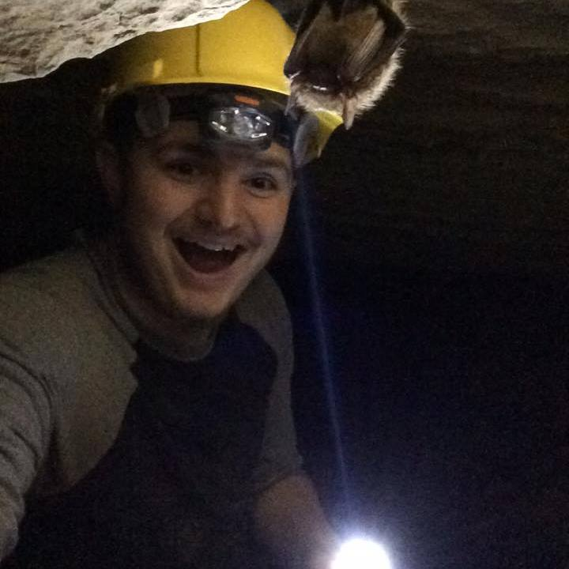

<figure>

</figure>

I'm a geology senior at App State. I was born in Florida, though being in an air force family I moved around a lot in my childhood, moving to Turkey, Alaska, North Dakota, and eventually North Carolina.

I'm interested in geology, paleontology, and politics. In my free time, I like to hike, read, and browse the internet. I'm also the secretary of the Appalachian Geological Society, which means I plan, lead, and attend geology trips with other students in the region. One example is caving in Eastern Tennessee, where I took the above photograph.